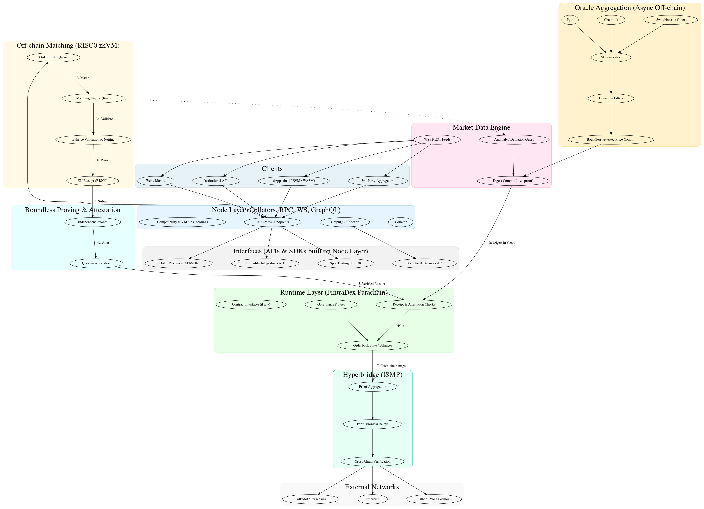

<div align="center">

# FintraDex Parachain

> **Cross-Chain DeFi Infrastructure on Polkadot**

[](https://fintradex.io/)
[](https://github.com/paritytech/polkadot-sdk)
[](https://www.rust-lang.org/)
[](https://polkadot.js.org/apps/?rpc=wss%3A%2F%2Ftestnet.fintra.network)

**Substrate parachain with Hyperbridge cross-chain interoperability, EVM compatibility, and advanced governance**

</div>

---

## 🌐 Network Information

**FintraDex is live on Paseo Testnet!** Connect and start exploring:

| Parameter | Value |
|-----------|-------|
| **Network** | Paseo Testnet |
| **Parachain ID** | 4910 |
| **RPC Endpoint** | `wss://testnet.fintra.network` |
| **Block Explorer** | [https://fintra-testnet.statescan.io/](https://fintra-testnet.statescan.io/) |
| **Polkadot.js Apps** | [Connect to FintraDex](https://polkadot.js.org/apps/?rpc=wss%3A%2F%2Ftestnet.fintra.network#/explorer) |

### Quick Connect
```bash
# Connect via Polkadot.js Apps
https://polkadot.js.org/apps/?rpc=wss%3A%2F%2Ftestnet.fintra.network#/explorer

# RPC Endpoint for MetaMask/Web3
wss://testnet.fintra.network
```

---

## 🚀 About FintraDex

FintraDex is building advanced cross-chain DeFi infrastructure on Polkadot. Our parachain combines Substrate's flexibility with Ethereum compatibility and cryptographic cross-chain bridges to enable secure, decentralized financial applications.

### 🎯 Our Mission
- **Cross-Chain Interoperability**: Secure asset transfers using Hyperbridge cryptographic proofs
- **EVM Compatibility**: Full Ethereum compatibility for existing DeFi protocols
- **Advanced Governance**: Multi-layer governance with democracy, councils, and referenda
- **Community-Driven Development**: Open-source infrastructure for the next generation of DeFi

## 🚀 Quick Start

### Prerequisites
- 🦀 **Rust**: 1.87.0 or higher
- 📦 **Cargo**: Latest version
- 🔧 **System Dependencies**: 
  - Ubuntu/Debian: `build-essential`, `cmake`, `pkg-config`, `libssl-dev`
  - macOS: Xcode Command Line Tools
  - Windows: Visual Studio Build Tools

#### Rust Setup
```bash
rustup default 1.87.0
rustup target add wasm32-unknown-unknown
rustup component add rust-src
```

#### Required Tools

Install Chain Spec Builder and Polkadot Omni Node:

```bash
# Install chain-spec-builder
cargo install --locked staging-chain-spec-builder@10.0.0

# Install polkadot-omni-node
cargo install --locked polkadot-omni-node@0.5.0
```

### Development Mode Setup

#### 1. Clone and Build
```bash
git clone https://github.com/fintradev/fintradex.git
cd fintradex
cargo build --release
```

#### 2. Generate Development Chain Spec
```bash
chain-spec-builder create -t development \
  --relay-chain paseo \
  --para-id 1000 \
  --runtime ./target/release/wbuild/fintradex-runtime/fintradex_runtime.compact.compressed.wasm \
  named-preset development
```

#### 3. Start Development Node
```bash
polkadot-omni-node --chain ./chain_spec.json --dev
```

Your parachain node is now running! 🎉


## 📁 Project Structure

```
fintradex-parachain/
├── runtime/                # Parachain runtime implementation
│   ├── src/
│   │   ├── lib.rs         # Runtime configuration and pallet integration
│   │   ├── configs/       
│   │   │   ├── evm.rs     # EVM pallet configuration
│   │   │   ├── ethereum.rs # Ethereum compatibility
│   │   │   ├── ismp.rs    # ISMP cross-chain protocol
│   │   │   ├── xcm_config.rs # XCM configuration
│   │   │   ├── staking.rs # Staking configuration
│   │   │   ├── democracy.rs # Governance configuration
│   │   │   └── ...        # Asset management, Treasury, etc.
│   │   ├── precompiles.rs # EVM precompiled contracts
│   │   └── weights/       # Performance benchmarks
│   └── Cargo.toml
├── node/                  # Node implementation
│   ├── src/
│   │   ├── main.rs        # Node entry point
│   │   ├── service.rs     # Node service configuration
│   │   ├── chain_spec.rs  # Chain specification
│   │   ├── eth.rs         # Ethereum RPC compatibility
│   │   └── rpc/           # RPC implementations
│   └── Cargo.toml
├── docs/                  # Architecture documentation
└── Cargo.toml            # Workspace configuration
```

**Key Implementation Details:**
- **Runtime Pallets**: [`runtime/src/configs/`](./runtime/src/configs/) - configured pallets for governance, assets, staking, and cross-chain
- **EVM Integration**: [`runtime/src/configs/evm.rs`](./runtime/src/configs/evm.rs) & [`runtime/src/precompiles.rs`](./runtime/src/precompiles.rs)
- **Cross-Chain (ISMP)**: [`runtime/src/configs/ismp.rs`](./runtime/src/configs/ismp.rs) - Hyperbridge, Token Gateway, ISMP protocol
- **Governance**: [`runtime/src/configs/democracy.rs`](./runtime/src/configs/democracy.rs), [`runtime/src/configs/collective.rs`](./runtime/src/configs/collective.rs), [`runtime/src/configs/refrenda.rs`](./runtime/src/configs/refrenda.rs)
- **Asset Management**: [`runtime/src/configs/assets.rs`](./runtime/src/configs/assets.rs), [`runtime/src/configs/asset_conversion.rs`](./runtime/src/configs/asset_conversion.rs)

## 🏗️ Architecture

<div align="center">



*FintraDex Architecture - High-Performance Cross-Chain Trading Platform with Off-Chain Orderbook Matching via RISC0 & Boundless*

</div>

The FintraDex parachain currently includes:

- 🌉 **Hyperbridge Integration** ✅ - Crypto-economic coprocessor for secure cross-chain interoperability
- 🔗 **EVM Compatibility** ✅ - Full Ethereum Virtual Machine compatibility for seamless DeFi integration
- 🏛️ **Advanced Governance** ✅ - Democracy, councils, referenda, and treasury management
- 💰 **Asset Management** ✅ - Multi-asset support with liquidity pools and asset conversion
- 🔐 **Staking & Security** ✅ - Nomination pools, collator selection, and offence handling

### 🔧 Technical Implementation

FintraDex runtime is built on Substrate with comprehensive pallet configurations for trading and DeFi functionality. See [`runtime/src/configs/`](./runtime/src/configs/) for all pallet implementations:

#### **Core Trading Infrastructure**
- **Asset Management**: Dual asset pallets (`Assets`, `PoolAssets`) for comprehensive asset handling
- **Asset Conversion**: Native asset conversion and liquidity pool management
- **Asset Rate Management**: Dynamic pricing and rate calculations
- **Token Gateway**: ISMP-powered cross-chain asset transfers and management

#### **Cross-Chain Interoperability**
- **ISMP Protocol**: Interoperability State Machine Protocol for secure cross-chain communication
- **Hyperbridge Pallet**: Cryptographic proof-based cross-chain verification
- **XCM Integration**: Cross-Consensus Message format for Polkadot ecosystem communication
- **XCMP Queue**: Cross-chain message processing and routing

#### **EVM & Smart Contract Support**
- **EVM Pallet**: Full Ethereum Virtual Machine compatibility
- **Ethereum Pallet**: Ethereum transaction processing and compatibility
- **Contracts Pallet**: WebAssembly smart contract execution
- **Precompiles**: Optimized cryptographic operations and DeFi primitives

## 🌉 Hyperbridge Integration

FintraDex leverages [Hyperbridge](https://docs.hyperbridge.network/) as a revolutionary crypto-economic coprocessor for secure cross-chain interoperability. This integration represents a paradigm shift from traditional multi-sig attestation networks to a trust-free, cryptographic proof-based system.

**Implementation**: [`runtime/src/configs/ismp.rs`](./runtime/src/configs/ismp.rs)
- `pallet_hyperbridge::Config` - Hyperbridge pallet configuration
- `pallet_ismp::Config` - ISMP protocol implementation
- `Coprocessor` parameter - Points to Hyperbridge on Polkadot parachain 3367
- `Router` implementation - Routes cross-chain messages to Hyperbridge module

### 🔐 Secure Interoperability
- **Cryptographic Proofs**: Verification of consensus proofs, consensus fault proofs, state proofs, and state transition validity proofs
- **On-Chain Verification**: All proofs are verified on-chain to confirm finalized (irreversible) state of counterparty chains
- **Coprocessor Model**: Off-chain verification operations with cryptographic proofs of correct execution reported back on-chain

### ⚡ Proof Aggregation
- **Scalable Trust-Free Interoperability**: Hyperbridge verifies and aggregates finalized states of all chains into a single proof
- **Universal Cross-Chain Messages**: Any blockchain can receive all cross-chain messages aggregated by Hyperbridge
- **Efficient Verification**: Eliminates the need for individual chain verification, reducing computational overhead

### 🚀 Permissionless Relayers
- **Decentralized Network**: First cross-chain protocol leveraging cryptographic proofs for permissionless relayers
- **No Whitelisting Required**: Relayers operate without whitelisting or staking requirements
- **Fee-Based Incentives**: Fully incentivized by user fees for cross-chain operations
- **Trust-Free Operation**: Cryptographic guarantees ensure secure message transmission

### 🎯 Benefits for FintraDex
- **Enhanced Security**: Eliminates the $2 billion+ losses from multi-sig attestation networks
- **Improved Scalability**: Efficient proof aggregation reduces verification costs
- **Universal Connectivity**: Seamless integration with any blockchain network
- **Developer-Friendly**: Simplified cross-chain development with cryptographic guarantees

## 🔗 ISMP & Token Gateway Integration

FintraDex implements the Interoperability State Machine Protocol (ISMP) with a sophisticated Token Gateway system for seamless cross-chain asset management.

**Implementation**: [`runtime/src/configs/ismp.rs`](./runtime/src/configs/ismp.rs)
- `pallet_ismp::Config` - Core ISMP protocol configuration with consensus clients
- `pallet_token_gateway::Config` - Token Gateway for cross-chain asset transfers
- `ismp_parachain::Config` - Parachain consensus client for ISMP
- `Router` - Message routing to TokenGateway and Hyperbridge modules
- `HostStateMachine` - State machine identifier (Polkadot parachain 1000)

### 🚀 Token Gateway Features
- **Cross-Chain Asset Transfers**: Secure asset movement between connected blockchains
- **ISMP Protocol**: State machine-based interoperability for trust-free cross-chain operations
- **Asset Administration**: Treasury-controlled asset management with community governance
- **EVM Integration**: Seamless integration between Substrate and Ethereum ecosystems

### 🔐 Security & Verification
- **Cryptographic Proofs**: All cross-chain operations verified through cryptographic guarantees
- **State Machine Validation**: ISMP ensures consistent state across all connected chains
- **Permissionless Relayers**: Decentralized network of relayers without whitelisting requirements
- **Fee-Based Incentives**: Economic incentives ensure reliable cross-chain message delivery

## 🗺️ Development Roadmap

### ✅ Foundation Infrastructure (Current)
**Q4 2024 - Q1 2025**
- ✅ Substrate parachain runtime with 38+ pallets
- ✅ Hyperbridge & ISMP integration for cross-chain interoperability
- ✅ Token Gateway for secure cross-chain asset transfers
- ✅ Full EVM compatibility via Frontier
- ✅ Advanced governance (Democracy, Council, Referenda, Treasury)
- ✅ Asset management with liquidity pools and conversions
- ✅ Staking infrastructure with nomination pools
- ✅ Paseo testnet deployment (live)

### 🚀 Phase 1: FintraLite Launch
**Q4 2025**

**FintraLite** is our hybrid off-chain exchange, bridging the gap between a CEX and a DEX.

**Key Features:**
- 🔄 **Non-Custodial Trading**: Connect your own wallet - you maintain full custody
- 🔄 **Liquidity Aggregation**: Aggregates liquidity from other DEXs for smooth trading from day one
- 🔄 **Token Generation Event (TGE)**: Late Q4 2025 - Launching Fintra token
- 🔄 **Community Governance**: Enable token holders to participate in protocol decisions

**Why off-chain first?**  
FintraLite provides an excellent trading experience while we build the foundation for our fully on-chain evolution. By aggregating liquidity from existing DEXs, we ensure deep liquidity and smooth trading from day one.

### 🔮 Phase 2: FintraDex Evolution
**Q2 2026**

**FintraDex** is our final product - a fully evolved on-chain trading solution with cutting-edge technology.

**Advanced Features:**
- 📋 **Hybrid CLOB Architecture**: Off-chain orderbook matching with on-chain trustless settlement
- 📋 **OrderBook DEX Pallet**: Custom Substrate pallet for on-chain orderbook with limit/market orders
- 📋 **RISC Zero ZK Proofs**: Zero-knowledge proofs for verifiable off-chain computation
- 📋 **Boundless Network Integration**: High-performance order matching with cryptographic guarantees
- 📋 **On-Chain Settlement**: Trustless settlement on Polkadot's Substrate framework
- 📋 **ZK-Privacy Layer**: Enhanced privacy for trading while maintaining regulatory compliance

**The Evolution:**  
FintraLite → FintraDex represents our journey from a hybrid off-chain exchange to a fully decentralized, ZK-powered trading platform with the best of both worlds: CEX performance with DEX trustlessness.

### 📍 Current Status
**Live on Paseo Testnet** with core cross-chain DeFi infrastructure. Preparing for Q4 2025 FintraLite launch with hybrid orderbook and TGE.

For detailed progress and updates, visit [fintradex.io](https://fintradex.io/) or track our [GitHub repository](https://github.com/fintradev/fintradex).

## 💰 Token Economics

The Fintra token powers the FintraDex ecosystem, enabling network security, governance, and sustainable growth.

### 🪙 Token Utility
- **Network Security**: Staking for collator selection and parachain consensus
- **Governance Rights**: Voting power for protocol decisions and upgrades
- **Transaction Fees**: Native token for gas fees and cross-chain operations
- **Trading Fees**: Fee payment for orderbook trades and advanced features
- **Liquidity Mining**: Rewards for providing liquidity to trading pairs
- **Treasury Funding**: Community-controlled development and ecosystem grants

### 📊 Current Phase (Paseo Testnet)
- Testing economic models with testnet tokens
- Governance mechanisms (Democracy, Council, Treasury)
- Staking infrastructure with nomination pools
- Cross-chain fee structures via ISMP/Hyperbridge

For detailed tokenomics, distribution, and economic model, see our [Economic Litepaper](./docs/Fintradex_Economic_Litepaper_v1.pdf).

## 📊 Technical Specifications

### **Runtime Parameters**
- **Block Time**: 6 seconds (optimized for trading operations)
- **Block Gas Limit**: 75,000,000 gas units
- **Max Block Weight**: 2,000,000,000 weight units
- **EVM Chain ID**: 0x1 (Ethereum mainnet compatible)
- **SS58 Prefix**: 42 (Polkadot ecosystem standard)

### **Performance Metrics**
- **Transaction Throughput**: 1,000+ TPS (theoretical)
- **Cross-Chain Latency**: Sub-second for Hyperbridge operations
- **Orderbook Matching**: Off-chain with cryptographic verification
- **Finality Time**: ~12 seconds (2 block confirmations)

### **Security Features**
- **Cryptographic Proofs**: RISC0 zero-knowledge verification
- **Multi-Signature Support**: Advanced multisig operations
- **Whitelist Management**: Controlled access mechanisms
- **Offence Handling**: Automated slashing for malicious behavior

## 📚 Documentation

- [Technical Architecture Whitepaper](./docs/Fintradex_Parachain_%20Technical_Architecture_Whitepaper.pdf) - Comprehensive technical documentation
- [Economic Litepaper](./docs/Fintradex_Economic_Litepaper_v1.pdf) - Economic model and tokenomics

## 🚢 Parachain Deployment on Paseo

### Prerequisites for Deployment

#### 1. Get Test Tokens
- Navigate to [Polkadot.js Apps](https://polkadot.js.org/apps/) and connect to Paseo network
- Visit [Polkadot Faucet](https://faucet.polkadot.io/) to get 100 PAS tokens
- Tokens are required for parachain registration and collator operations

#### 2. Reserve a Parachain ID
- Navigate to **Network > Parachains > Parathreads**
- Click **"+ ParaId"** and submit the transaction
- Verify registration in **Explorer** for `registrar.Reserved` event

#### 3. Generate Collator Keys
```bash
# Generate account keys (sr25519)
subkey generate --scheme sr25519

# Generate session keys (sr25519 for Aura)
subkey generate --scheme sr25519
```

**Important**: Store account keys offline. Session keys should be rotated regularly.

### Deployment Steps

#### 1. Generate Plain Chain Spec
```bash
chain-spec-builder --chain-spec-path ./fintradex_plain_chain_spec.json create \
  --relay-chain paseo \
  --para-id YOUR_PARA_ID \
  --runtime target/release/wbuild/fintradex-runtime/fintradex_runtime.compact.compressed.wasm \
  named-preset local_testnet
```

#### 2. Edit Chain Specification
Edit `fintradex_plain_chain_spec.json`:
- Update `name`, `id`, and `protocolId` fields
- Set `para_id` and `parachainInfo.parachainId` to your reserved ID
- Configure initial `balances` for accounts
- Insert collator keys in `collatorSelection.invulnerables` and `session.keys`
- Set `sudo` account

#### 3. Convert to Raw Format
```bash
chain-spec-builder --chain-spec-path ./fintradex_raw_chain_spec.json convert-to-raw fintradex_plain_chain_spec.json
```

#### 4. Export Wasm and Genesis State
```bash
# Export Wasm runtime
polkadot-omni-node export-genesis-wasm --chain fintradex_raw_chain_spec.json para-wasm

# Export genesis state
polkadot-omni-node export-genesis-head --chain fintradex_raw_chain_spec.json para-state
```

#### 5. Register Parachain
- Go to **Parachains > Parathreads > + Parathread**
- Upload `para-wasm` in the code field
- Upload `para-state` in the initial state field
- Submit transaction

#### 6. Start Collator Node
```bash
# Generate node key
polkadot-omni-node key generate-node-key --base-path data --chain fintradex_raw_chain_spec.json

# Start collator
polkadot-omni-node --collator \
  --chain fintradex_raw_chain_spec.json \
  --base-path data \
  --port 40333 \
  --rpc-port 9944 \
  --force-authoring \
  --rpc-cors all \
  --node-key-file ./data/chains/fintradexidXXXX/network/secret_ed25519 \
  -- --sync warp \
  --chain paseo \
  --port 50343 \
  --rpc-port 9988
```

#### 7. Insert Session Keys
```bash
curl -H "Content-Type: application/json" \
--data '{
  "jsonrpc":"2.0",
  "method":"author_insertKey",
  "params":[
    "aura",
    "YOUR_SECRET_PHRASE",
    "YOUR_PUBLIC_KEY_HEX"
  ],
  "id":1
}' \
http://localhost:9944
```

#### 8. Obtain Coretime
Navigate to **Developer > Extrinsics** and execute:
- Extrinsic: `onDemand.placeOrderAllowDeath`
- Set `maxAmount` and your `paraId`

Your parachain is now live! 🎉

For detailed deployment instructions, see the [full deployment guide](./DEPLOYMENT.md).

## 🤝 Contributing

We welcome contributions from the community! Please read our [Contributing Guidelines](./CONTRIBUTING.md) before submitting pull requests.

## 📄 License

This project is licensed under the Apache License 2.0 - see the [LICENSE](LICENSE) file for details.

## 🌐 Links

- **Technical Architecture Whitepaper**: [Technical Whitepaper](./docs/Fintradex_Parachain_%20Technical_Architecture_Whitepaper.pdf)
- **Economic Litepaper**: [Economic Litepaper](./docs/Fintradex_Economic_Litepaper_v1.pdf)
- **Website**: [https://fintradex.io/](https://fintradex.io/)
- **Testnet Explorer**: [https://polkadot.js.org/apps/?rpc=wss%3A%2F%2Ftestnet.fintra.network#/explorer](https://polkadot.js.org/apps/?rpc=wss%3A%2F%2Ftestnet.fintra.network#/explorer)
- **Hyperbridge Documentation**: [https://docs.hyperbridge.network/](https://docs.hyperbridge.network/)
- **RISC0 Documentation**: [https://risczero.com/](https://risczero.com/)
- **Boundless Network**: [https://docs.boundless.network/](https://docs.boundless.network/)
- **X**: [https://x.com/FintraDex](https://x.com/FintraDex)
- **Telegram**: [https://t.me/fintradex](https://t.me/fintradex)

## 🙏 Acknowledgments

- [Polkadot](https://polkadot.network/) - The foundation for cross-chain interoperability
- [Substrate](https://substrate.io/) - The blockchain development framework
- [Parity Technologies](https://www.parity.io/) - The team behind Polkadot and Substrate
- [Hyperbridge](https://docs.hyperbridge.network/) - Revolutionary crypto-economic coprocessor for secure cross-chain interoperability
- [Polytope Labs](https://polytope.network/) - The team behind Hyperbridge protocol

---

## ⚖️ Legal Notice

This is open-source software provided "as-is" under the Apache 2.0 license. No warranties are made regarding functionality, security, or fitness for any purpose. This documentation is for informational purposes only and does not constitute financial, investment, or legal advice.

**Token Disclaimer**: Information regarding future token generation events, tokenomics, or economic models represents current plans and is subject to change. No tokens are currently available for purchase or sale.

**Risk Warning**: Participation in blockchain networks and DeFi protocols involves substantial risk. Users should conduct their own research and consult qualified professionals before making any decisions.

For official announcements, visit [fintradex.io](https://fintradex.io)

---

<div align="center">

**Built with ❤️ by the FintraDex Team**

[](https://fintradex.io/)

</div> 